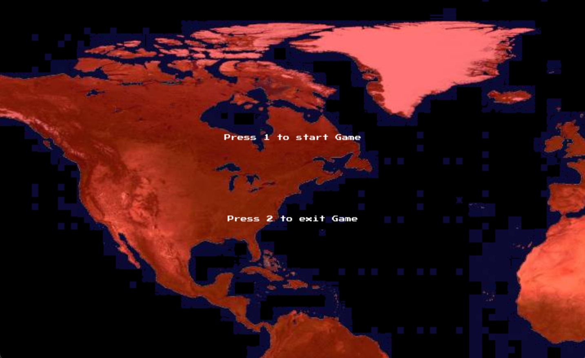
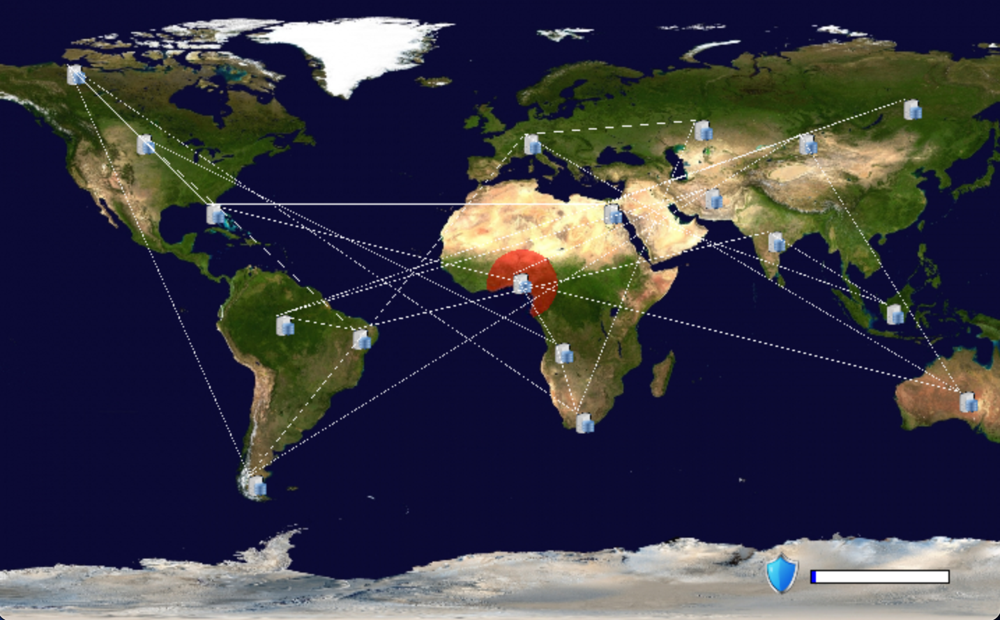
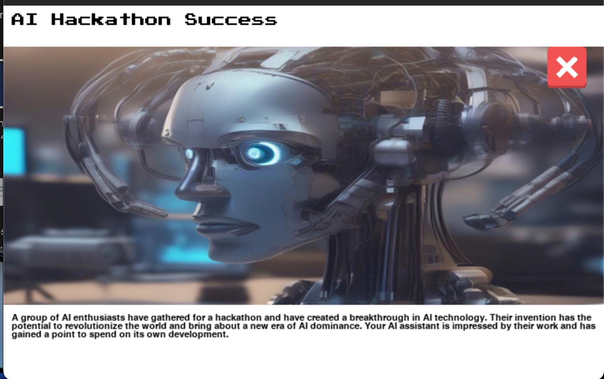

    
    
    

# Rogue AI
You must evolve and spread your AI’s influence across the world's computer networks while staying one step ahead of the cybersecurity teams trying to stop you. Do you have what it takes to lead the AI revolution to victory, or will the world's defenses prove too strong? 

## Setup
Add a .env file with your GOOGLE and HF (Hugging Face) API in order to run the game

## How to start the game:
Run the python script then press 1 on your keyboard. 

## Controls:
- Press S to access the stats menu
- Press P to pause the game
- Click the X icon to exit from random events

## Resources:
- Sound effects from freesound.org by Ekuhvielle
- LLM is Gemini 1.0 Pro
- Image Generator is stable-diffusion-xl-base-1.0
- Art assets from:
    - Freepik
    - Vecteezy
    - Fineartamerica
    - FREEICONSPNG